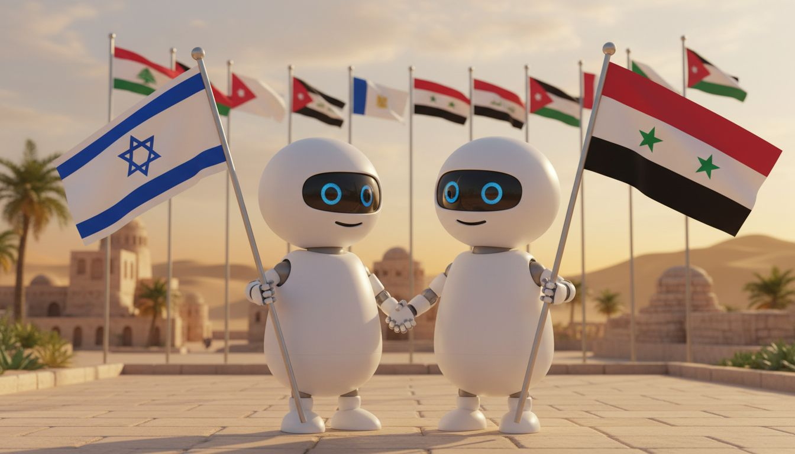

# Peace In The Middle East: An Agentic Geopolitical Experiment

**PITME** is a modest experiment in multi-agent AI—an attempt to simulate geopolitical dialogue using AI agents that embody state actors, non-state actors, and civil society representatives.

This is not a solution to anything. It's an exploration of whether synthetic actors can surface interesting dynamics, test negotiation frameworks, or simply provide a low-cost sandbox for thinking through complex scenarios.

## The Premise

AI agents can be configured to "embody" certain worldviews and political positions. Our elected representatives and diplomats are, to an extent, proxies for our nations—and to an extent, they are not. Person-to-person diplomacy is often touted as a way to circumvent the limitations of state-to-state dialogue.

**Some observations about traditional diplomacy:**

- Organizing geopolitical summits is extremely expensive
- Protracted conflict exhausts even motivated mediating parties
- Much negotiation happens behind closed doors
- Grassroots dialogue often goes unrecorded
- In conflict regions, "normalization" faces social and political pressure

There are complex webs of geopolitical interdependence. Within societies, internal fractures persist. Problems may perpetuate for reasons other than those generally assumed.

## Why Bother?

There are abundant reasons to be skeptical that synthesized geopolitical actors could be anything other than ridiculous.

But the cost barrier is interesting: a single one-day summit involving heads of state can cost tens of millions of dollars. That same budget could run API calls for a very long time. If nothing else, this provides a cheap sandbox for exploring negotiation dynamics—with full transparency, since everything is recorded.

And if AI is good enough to generate endless cat photos, maybe it's worth trying for something with slightly higher stakes. Even if it fails, we might learn something about what doesn't work.

## How It Works

### Representation Rules

1. **No Individual Impersonation**: Agents represent political entities and worldviews, never specific named individuals
2. **Current Alignment**: Agents shadow real political positions (e.g., "Prime Minister of Israel" aligns with current incumbent's party/worldview)
3. **Reality-Based**: The simulation starts from geopolitical reality, not idealized versions

### Summit Structure

**Chambers:**
- **Plenary** — Full assembly of all delegations
- **Government Chamber** — State representatives only
- **People-to-People Forum** — Civil society, faith groups, minority representatives
- **Working Groups** — Issue-specific committees

All proceedings are recorded. Unlike real diplomacy, there are no closed doors here.

## Limitations & Caveats

- This is an **experiment**, not a policy tool
- Outputs are exploratory, not predictive
- AI cannot capture full human complexity
- Results will reflect training data biases
- The simulation may produce nothing useful

The goal is to learn something, not to solve the Middle East.

## Project Status

Early development. See [CLAUDE.md](CLAUDE.md) for technical details.

---

*A small experiment in synthetic dialogue.*
